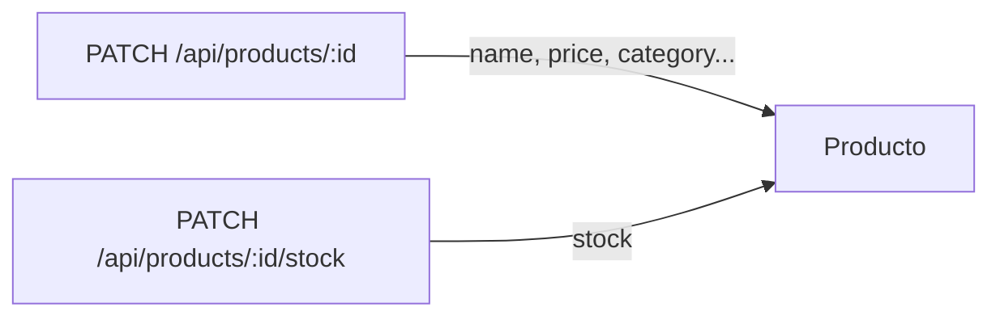

# Referencia API REST — Inventario

API de categorías y productos expuesta como Route Handlers de Next.js bajo `/api/*`. Misma URL y despliegue que la aplicación web.

**Implementación:** `src/app/api/categories/`, `src/app/api/products/`  
**Validación:** `src/lib/validators/category.ts`, `src/lib/validators/product.ts`  
**Colección Postman:** `tools/postman/carpinteria-api.postman_collection.json`

---

## Autenticación

Todas las rutas de inventario requieren sesión NextAuth (cookie). Sin sesión válida:

| Status | Cuerpo |
|--------|--------|
| **401** | `{ "error": "No autenticado" }` |

La comprobación ocurre en el middleware (`middleware.ts`) y de nuevo en cada handler con `requireApiSession()` (`src/lib/api-auth.ts`).

Para comprobar si hay sesión activa: `GET /api/auth/session` (NextAuth). Flujo de login y rutas protegidas: [Middleware y protección de rutas](seguridad/middleware.md).

---

## Errores comunes

Estos códigos aplican a cualquier endpoint que use body JSON o parámetros validados con Zod. En las tablas de cada endpoint solo se listan errores **específicos** además de estos.

| Status | Cuerpo |
|--------|--------|
| **401** | `{ "error": "No autenticado" }` |
| **400** (JSON inválido) | `{ "error": "Cuerpo JSON no válido" }` |
| **400** (validación Zod) | `{ "error": "Error de validación", "issues": [ ... ] }` |
| **404** | `{ "error": "No encontrado" }` |

Errores no capturados (p. ej. fallo de base de datos) se propagan y Next.js suele responder **500** sin formato personalizado.

---

## Modelos de respuesta

### Categoría

Objeto devuelto en listados, creación, actualización y borrado:

```json
{
  "id": "clx…",
  "name": "Maderas",
  "createdAt": "2026-05-22T12:00:00.000Z",
  "updatedAt": "2026-05-22T12:00:00.000Z"
}
```

### Producto

En respuestas de productos, `price` es siempre **string** (serialización de `Decimal` de Prisma). Incluye la categoría anidada cuando el handler hace `include: { category: true }`:

```json
{
  "id": "clx…",
  "name": "Tablero roble",
  "description": null,
  "sku": "ROB-001",
  "price": "45.90",
  "stock": 12,
  "categoryId": "clx…",
  "createdAt": "2026-05-22T12:00:00.000Z",
  "updatedAt": "2026-05-22T12:00:00.000Z",
  "category": {
    "id": "clx…",
    "name": "Maderas",
    "createdAt": "2026-05-22T12:00:00.000Z",
    "updatedAt": "2026-05-22T12:00:00.000Z"
  }
}
```

> **Nota:** No existe `GET /api/products/:id`. El detalle se obtiene filtrando el listado o usando el `id` devuelto en mutaciones.

---

## Categorías

### `GET /api/categories`

| Método | Ruta | Body / query | Éxito | Errores |
|--------|------|--------------|-------|---------|
| GET | `/api/categories` | — | **200** — `Category[]` ordenadas por `name` asc | (solo comunes: 401) |

---

### `POST /api/categories`

| Método | Ruta | Body / query | Éxito | Errores |
|--------|------|--------------|-------|---------|
| POST | `/api/categories` | `{ "name": string }` — obligatorio, 1–120 caracteres (trim) | **201** — `Category` creada | **409** `{ "error": "Ya existe una categoría con ese nombre" }` |

---

### `PATCH /api/categories/:id`

| Método | Ruta | Body / query | Éxito | Errores |
|--------|------|--------------|-------|---------|
| PATCH | `/api/categories/:id` | `{ "name"?: string }` — al menos un campo; `name` 1–120 caracteres | **200** — `Category` actualizada | **404**; **409** `{ "error": "Ya existe una categoría con ese nombre" }` |

Parámetro de ruta: `id` (cuid de la categoría en base de datos).

---

### `DELETE /api/categories/:id`

| Método | Ruta | Body / query | Éxito | Errores |
|--------|------|--------------|-------|---------|
| DELETE | `/api/categories/:id` | — | **200** — `Category` eliminada | **404**; **409** `{ "error": "No se puede eliminar la categoría porque tiene productos asociados" }` |

---

## Productos

### `GET /api/products`

| Método | Ruta | Body / query | Éxito | Errores |
|--------|------|--------------|-------|---------|
| GET | `/api/products` | Query opcional: `search` (string, búsqueda en nombre y descripción, case-insensitive), `categoryId` (string), `sortBy` (`name` \| `price` \| `stock` \| `createdAt` \| `updatedAt`, default `name`), `sortOrder` (`asc` \| `desc`, default `asc`). Valores vacíos en query se ignoran. | **200** — `Product[]` con `category` anidada y `price` como string | **400** (query inválida) |

---

### `POST /api/products`

| Método | Ruta | Body / query | Éxito | Errores |
|--------|------|--------------|-------|---------|
| POST | `/api/products` | `{ "name": string, "description"?: string, "sku"?: string, "price": number, "stock"?: number, "categoryId": string }` — `name` 1–200; `description` max 5000; `sku` max 80; `price` > 0; `stock` entero ≥ 0 (default **0**); `categoryId` obligatorio | **201** — `Product` con `category` | **409** `{ "error": "Ya existe un producto con ese SKU" }`; **400** `{ "error": "La categoría indicada no existe" }` |

El stock inicial solo se define aquí, en el alta del producto.

---

### `PATCH /api/products/:id`

| Método | Ruta | Body / query | Éxito | Errores |
|--------|------|--------------|-------|---------|
| PATCH | `/api/products/:id` | `{ "name"?: string, "description"?: string \| null, "sku"?: string \| null, "price"?: number, "categoryId"?: string }` — al menos un campo; **no incluye `stock`** | **200** — `Product` con `category` | **404**; **409** SKU duplicado; **400** categoría inexistente |

Errores específicos de conflicto y FK:

- **409** `{ "error": "Ya existe un producto con ese SKU" }`
- **400** `{ "error": "La categoría indicada no existe" }`

---

### `DELETE /api/products/:id`

| Método | Ruta | Body / query | Éxito | Errores |
|--------|------|--------------|-------|---------|
| DELETE | `/api/products/:id` | — | **200** — `Product` eliminado (`price` string; sin `category` anidada en la respuesta) | **404** |

---

### UI (página Productos)

Ruta: `/products`. Componentes en `src/components/inventory/`.

| Acción en UI | Componente | Endpoint |
|--------------|------------|----------|
| **Crear** | Formulario «Nuevo producto» (`ProductForm`, modo `create`) | `POST /api/products` |
| **Editar** | Lápiz en tarjeta → formulario inline (`ProductForm`, modo `edit`) | `PATCH /api/products/:id` (sin `stock`) |
| **Ajustar stock** | Botones ± en tarjeta (`ProductCard`) | `PATCH /api/products/:id/stock` |
| **Eliminar** | Papelera → `ConfirmDialog` → confirmar | `DELETE /api/products/:id` |

**React Query:** tras crear, editar o borrar un producto, las mutaciones en `src/hooks/inventory/use-product-mutations.ts` invalidan `products` y `categories` (el listado de productos muestra el nombre de categoría anidado). El stock usa `useUpdateStockMutation` con actualización optimista e invalidación de listas filtradas.

**Errores en UI:** los mensajes del cuerpo `{ "error": "…" }` se muestran bajo el formulario o bajo el diálogo de borrado. Casos habituales al editar: **409** SKU duplicado, **400** categoría inexistente, **404** producto no encontrado. El borrado de producto no devuelve **409** por dependencias (a diferencia de `DELETE /api/categories/:id`).

---

## Stock (`/api/products/:id/stock`)

No existe una ruta global `/api/stock`. El inventario se actualiza en el sub-recurso anidado del producto.

### `PATCH /api/products/:id/stock`

| Método | Ruta | Body / query | Éxito | Errores |
|--------|------|--------------|-------|---------|
| PATCH | `/api/products/:id/stock` | `{ "stock": number }` — entero ≥ 0 | **200** — `Product` completo con `category` y `price` como string | **404** |

Implementación: `src/app/api/products/[id]/stock/route.ts`.

---

## Por qué el stock está separado

El stock no se actualiza con `PATCH /api/products/:id`. Tiene su propio endpoint `PATCH /api/products/:id/stock`. Motivos de diseño:

### 1. Contrato explícito en validación

En `src/lib/validators/product.ts`, `updateProductSchema` **no** admite el campo `stock`. El comentario del schema lo deja explícito: el stock solo se actualiza en `/api/products/[id]/stock`, mediante `updateProductStockSchema` (`{ stock: number }`).

Si un cliente envía `stock` en `PATCH /api/products/:id`, Zod no lo incluye en el schema: **no se persiste** en base de datos (no hay actualización silenciosa).

### 2. Responsabilidad única

| Endpoint | Responsabilidad |
|----------|-----------------|
| `PATCH /api/products/:id` | Ficha de catálogo: nombre, descripción, SKU, precio, categoría |
| `PATCH /api/products/:id/stock` | Inventario: cantidad en almacén |

Separar catálogo e inventario evita mezclar reglas de negocio distintas en un mismo handler y en un mismo schema.

### 3. Límite de módulo en código

- Catálogo: `src/app/api/products/[id]/route.ts`
- Stock: `src/app/api/products/[id]/stock/route.ts`

Cada archivo tiene un único propósito HTTP, alineado con la estructura de carpetas del App Router.

### 4. Ciclo de vida distinto

- **Alta:** `POST /api/products` acepta `stock` opcional (default 0) para el valor inicial.
- **Ajustes posteriores:** solo `PATCH /api/products/:id/stock`.

Refleja el flujo habitual: se crea el producto con un stock de partida; los movimientos de inventario van por otra operación.

### 5. Evolución del sistema

Un endpoint dedicado facilita, sin romper el contrato de edición de producto:

- permisos distintos (p. ej. solo almacén puede cambiar stock),
- auditoría de movimientos,
- UI de “ajuste de inventario” separada del formulario de ficha.

### Diagrama



---

## Otros endpoints

- **`/api/tasks`** — API de tareas del boilerplate (persistencia en cookies). Código en `src/app/api/tasks/`. No forma parte del módulo de inventario.
- **`/api/auth/*`** — NextAuth (sesión, proveedores, callbacks). Ver [OAuth 2.0 / GitHub](seguridad/oauth.md) y [Credenciales](seguridad/credenciales.md).

---

## Checklist tarjeta 4.6

- [x] Todos los endpoints de inventario documentados con códigos 200/201/400/401/404/409
- [x] Stock documentado en ruta dedicada `/api/products/:id/stock`
- [x] Enlace desde `README.md` y `docs/arquitectura.md`

---

## Documentación relacionada

- [Arquitectura del inventario](arquitectura.md)
- [Gestión de estado](state-management.md)
- [Middleware y protección de rutas](seguridad/middleware.md)
