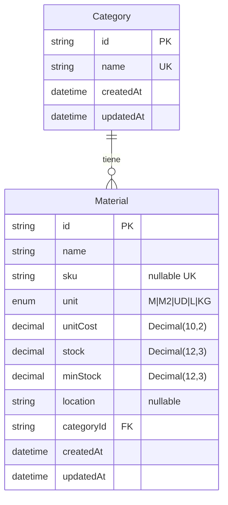

# Arquitectura del sistema de inventario (v1.3)

> Documento de diseño — Evoluciona desde día 1. Incluye capas acordadas, modelo de datos (Category / Material) y uso de Postgres vía Prisma.

## Visión general

Sistema de inventario para el taller de carpintería. Tres capas:

1. **Navegador (React)** — UI, estado local de interfaz y caché de datos del servidor.
2. **Next.js** — App Router, Server Components (RSC), Route Handlers (`/api/*`) y middleware.
3. **PostgreSQL** — Persistencia relacional (Neon en la nube), accedida desde el servidor vía Prisma.

## Diagrama de capas (ASCII)

```
┌─────────────────────────────────────────────────────────────┐
│  NAVEGADOR (React — Client Components)                      │
│  ┌─────────────────────┐  ┌──────────────────────────────┐  │
│  │ Zustand             │  │ TanStack Query               │  │
│  │ · filtros           │  │ · materiales, categorías     │  │
│  │ · búsqueda          │  │ · cache, refetch, loading    │  │
│  │ · panel activo      │  │ · mutaciones → invalidar     │  │
│  └─────────────────────┘  └──────────────────────────────┘  │
│           │                            │                     │
│           │  fetch / mutate            │                     │
└───────────┼────────────────────────────┼─────────────────────┘
            ▼                            ▼
┌─────────────────────────────────────────────────────────────┐
│  NEXT.JS (mismo despliegue — Vercel)                        │
│  ┌─────────────────────┐  ┌──────────────────────────────┐  │
│  │ RSC + layouts       │  │ Route Handlers               │  │
│  │ · páginas servidor  │  │ GET/POST /api/materials      │  │
│  │ · sesión (NextAuth) │  │ GET/POST /api/categories     │  │
│  │ · middleware        │  │ · Zod + requireApiSession()  │  │
│  └─────────────────────┘  └──────────────────────────────┘  │
│                            │                                 │
│                            ▼                                 │
│                   Prisma → src/lib/db.ts                     │
└────────────────────────────┼────────────────────────────────┘
                             ▼
┌─────────────────────────────────────────────────────────────┐
│  POSTGRESQL (Neon)                                          │
│  · tablas Category, Material (y relaciones)                 │
└─────────────────────────────────────────────────────────────┘
```

### Flujo de una lectura de materiales (objetivo)

1. El usuario abre `/products` (página protegida por middleware; UI de materiales).
2. Un Client Component monta TanStack Query con clave `['materials']`.
3. Query hace `GET /api/materials` (cookie de sesión NextAuth).
4. El Route Handler valida sesión, consulta Prisma y devuelve JSON.
5. TanStack Query guarda el resultado; Zustand solo guarda filtros/UI (no duplica la lista en servidor).

## Por qué no un Express separado

| Criterio | Next.js único | Express + React aparte |
|----------|---------------|-------------------------|
| Despliegue | Un proyecto en Vercel (misma URL actual) | Dos servicios, CORS, dos envs |
| Auth | Middleware + `getServerSession` en RSC y APIs | Repetir sesión/JWT entre apps |
| Tipos y código | `@/lib`, Zod y Prisma compartidos | Duplicar validación y DTOs |
| Enunciado del ejercicio | Route Handlers = API REST en el mismo repo | Capa extra sin beneficio en MVP |

**Conclusión:** la API vive en `src/app/api/**/route.ts`. No se crea servidor Express.

## Autenticación (extra respecto al enunciado mínimo)

El enunciado mínimo puede asumir solo “usuario logueado”. En este proyecto:

| Pieza | Ubicación | Rol |
|-------|-----------|-----|
| **NextAuth (Auth.js)** | `src/lib/auth.ts`, `src/app/api/auth/[...nextauth]/route.ts` | Sesión JWT, proveedores |
| **Firebase Auth** | `src/lib/firebase-auth-rest.ts` (login), `src/lib/firebase-client.ts` (registro) | Credenciales email/contraseña |
| **GitHub OAuth** | Opcional vía `GITHUB_ID` / `GITHUB_SECRET` | Login social |
| **Protección** | `middleware.ts`, `src/lib/protected-api-routes.ts` | Redirect a `/login` y `401` en APIs |

**UI:** Carbon Design System en `/login` y `/register` (`@carbon/react` en `auth-login-form.tsx`). Inventario usa shadcn, sin mezclar Carbon en el módulo privado de almacén.

Variables de entorno: ver `.env.example` y `README.md`.

## Estado actual del repo (entrega v1)

| Elemento | Estado |
|----------|--------|
| `npm run dev` | Script en `package.json` |
| Login + middleware | Implementado (NextAuth + Firebase + GitHub opcional) |
| Sidebar → `/products`, `/categories` | UI de almacén (Materiales/Categorías) |
| Carbon en `/login` | `Button`, `TextInput`, `PasswordInput` de Carbon |
| Zustand / TanStack Query | Implementado — ver [state-management.md](./state-management.md) |
| PostgreSQL / Prisma (Neon) | Implementado — `prisma/schema.prisma`, `src/lib/db.ts` |
| APIs inventario | `GET/POST/PATCH/DELETE` en `/api/categories`, `/api/materials`, stock en `/api/materials/:id/stock`, movimientos en `/api/materials/:id/movements` |
| Pedidos (`Task`) | Cookie `taskflow_tasks` (legacy del boilerplate; no es inventario) |

Documentación del módulo inventario:

- [Referencia API REST](./api.md)
- [Gestión de estado](./state-management.md)

Documentación de auth y navegación:

- [Flujo público/privado](./navigation-flow.md)
- [OAuth](./seguridad/oauth.md)
- [Middleware](./seguridad/middleware.md)
- [Credenciales](./seguridad/credenciales.md)

## Modelo de datos (PostgreSQL / Prisma)

Esquema en `prisma/schema.prisma`. En base de datos las tablas se mapean a `categories` y `materials` (`@@map`).

### Diagrama relación Category ↔ Material

Relación **uno a muchos**: cada categoría tiene cero o más materiales; cada material tiene exactamente una categoría. La FK lleva `onDelete: Restrict` (no se puede borrar una categoría si aún tiene materiales).

```
┌─────────────────────┐         ┌──────────────────────────────┐
│ categories          │         │ materials                    │
├─────────────────────┤         ├──────────────────────────────┤
│ id           (PK)   │◄────────│ categoryId (FK) → categories │
│ name         UNIQUE │    1  N │ id                   (PK)    │
│ createdAt           │         │ name, sku?, unit             │
│ updatedAt           │         │ unitCost NUMERIC(10,2)       │
└─────────────────────┘         │ stock, minStock, location?   │
                               │ createdAt, updatedAt          │
                               └──────────────────────────────┘
```



### Entidades (implementación actual)

**Category**

- `id` — `String` @ `cuid()`
- `name` — único
- `createdAt`, `updatedAt`

**Material**

- `id` — `String` @ `cuid()`
- `name`, `sku?` (opcional, único si existe)
- `unit` — enum (`M`, `M2`, `UD`, `L`, `KG`)
- `unitCost` — ver siguiente apartado
- `stock` — decimal físico ≥ 0 (default `0`)
- `minStock` — decimal mínimo ≥ 0 (default `0`)
- `location?` — texto opcional de ubicación en almacén
- `categoryId` → FK a `Category`, índice en `categoryId`
- `createdAt`, `updatedAt`

### Decimal vs Float en costes y stock

En inventario y dinero se usa **precisión decimal fija**, no coma flotante binaria.

| Enfoque | Problema típico |
|---------|-----------------|
| **Float / `double precision` en SQL** | Representación binaria: valores como `0.1 + 0.2` no son exactos; sumas e IVA acumulan errores. |
| **Decimal / `NUMERIC` en PostgreSQL** | Almacena escala y precisión de forma exacta; adecuado para moneda y listas de precios. |

En este proyecto, `unitCost` es `Decimal` en Prisma con `@db.Decimal(10, 2)` y `stock`/`minStock` son `Decimal(12,3)`. En runtime el cliente Prisma expone `Decimal` (no un `number` de JS crudo); conviene serializar/formatar en capa API o UI según necesidad.

### Stock de almacén (disponible, reservado, físico, mínimo)

En la UI de almacén se visualizan cuatro magnitudes:

- **Físico**: stock actual calculado por movimientos (`IN`, `OUT`, `ADJUST`) y persistido en `materials.stock`.
- **Reservado**: suma activa de reservas por pedido (`order_reservations`).
- **Disponible**: `físico - reservado`.
- **Mínimo**: umbral de reposición (`materials.minStock`).

Regla de aviso:

- **Stock bajo** cuando `disponible < mínimo`.

### DATABASE_URL (pooled) vs DIRECT_URL (migraciones)

Neon (y otros Postgres serverless) suelen ofrecer **dos URLs**:

| Variable | Uso recomendado | Motivo |
|----------|-----------------|--------|
| **`DATABASE_URL`** | Aplicación en runtime (`src/lib/db.ts`) | URL con **connection pooling** (pgBouncer): muchas requests cortas en serverless/Vercel sin agotar conexiones al compute de Postgres. |
| **`DIRECT_URL`** | CLI de Prisma: `migrate`, `db push`, seed vía configuración | Las migraciones y algunas operaciones necesitan conexión **directa** al Postgres, no el modo transaccional limitado del pooler. |

En este repo, `prisma.config.ts` fija la URL del datasource del CLI a `env("DIRECT_URL")` para migraciones; el cliente en ejecución usa `process.env.DATABASE_URL` (pooling ON en Neon). Ver comentarios en `.env.example`.

**Resumen:** pooling para la app, conexión directa para migrar y mantener el esquema.

### Tareas de despliegue (Neon + Vercel)

1. Cuenta Neon + `DATABASE_URL` (pooling ON) y `DIRECT_URL` (pooling OFF) en `.env.local` y Vercel.
2. `npx prisma migrate deploy` en el entorno de producción (o migraciones aplicadas en el pipeline).
3. `npx prisma db seed` solo en desarrollo/demo si lo necesitas.
4. Redeploy en Vercel tras cambiar variables.

## Gate entrega (verificación manual)

Marcar cuando todo pase:

- [x] `npm run dev` arranca sin error en `http://localhost:3000`
- [x] Login con email/contraseña (Firebase) llega a `/dashboard`
- [x] Sidebar: **Materiales** → `/products` muestra listado y CRUD
- [x] Sidebar: **Categorías** → `/categories` muestra listado y CRUD
- [x] `/login` muestra controles Carbon
- [x] Sin sesión, `/products` redirige a `/login`
- [x] `docs/arquitectura.md`, `docs/api.md`, `docs/state-management.md` completos
- [x] README con inventario, auth y variables Neon

## Checklist tarjeta 4.6

- [x] `docs/arquitectura.md` — capas, modelo Category/Material, Neon `DATABASE_URL` / `DIRECT_URL`
- [x] `docs/api.md` — endpoints inventario + stock separado
- [x] `docs/state-management.md` — Query + Zustand
- [x] README actualizado
- [ ] PR abierto hacia `main`

## Versión

- **v1** — Día 1: arquitectura documentada; BD y Query/Zustand en implementación posterior.
- **v1.1** — Modelo de datos en docs: diagrama Category–Product, precios Decimal, `DATABASE_URL` vs `DIRECT_URL`.
- **v1.2** — Entrega: estado del repo alineado con inventario implementado; checklists 4.6 y gate de entrega.
- **v1.3** — Migración UI de inventario a almacén: Product → Material, stock derivado y movimientos por material.
