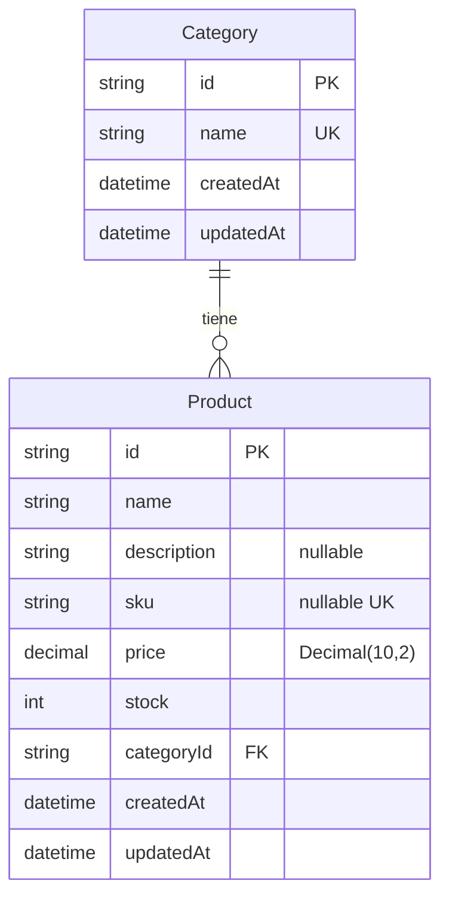

# Arquitectura del sistema de inventario (v1.1)

> Documento de diseño — Evoluciona desde día 1. Incluye capas acordadas, modelo de datos (Category / Product) y uso de Postgres vía Prisma.

## Visión general

Sistema de inventario para el taller de carpintería. Tres capas:

1. **Navegador (React)** — UI, estado local de interfaz y caché de datos del servidor.
2. **Next.js** — App Router, Server Components (RSC), Route Handlers (`/api/*`) y middleware.
3. **PostgreSQL** — Persistencia relacional (Neon en la nube), accedida desde el servidor vía Prisma.

## Diagrama de capas (ASCII)

```
┌─────────────────────────────────────────────────────────────┐
│  NAVEGADOR (React — Client Components)                      │
│  ┌─────────────────────┐  ┌──────────────────────────────┐  │
│  │ Zustand             │  │ TanStack Query               │  │
│  │ · filtros           │  │ · productos, categorías      │  │
│  │ · búsqueda          │  │ · cache, refetch, loading    │  │
│  │ · panel activo      │  │ · mutaciones → invalidar     │  │
│  └─────────────────────┘  └──────────────────────────────┘  │
│           │                            │                     │
│           │  fetch / mutate            │                     │
└───────────┼────────────────────────────┼─────────────────────┘
            ▼                            ▼
┌─────────────────────────────────────────────────────────────┐
│  NEXT.JS (mismo despliegue — Vercel)                        │
│  ┌─────────────────────┐  ┌──────────────────────────────┐  │
│  │ RSC + layouts       │  │ Route Handlers               │  │
│  │ · páginas servidor  │  │ GET/POST /api/products       │  │
│  │ · sesión (NextAuth) │  │ GET/POST /api/categories     │  │
│  │ · middleware        │  │ · Zod + requireApiSession()  │  │
│  └─────────────────────┘  └──────────────────────────────┘  │
│                            │                                 │
│                            ▼                                 │
│                   Prisma → src/lib/db.ts                     │
└────────────────────────────┼────────────────────────────────┘
                             ▼
┌─────────────────────────────────────────────────────────────┐
│  POSTGRESQL (Neon)                                          │
│  · tablas Category, Product (y relaciones)                  │
└─────────────────────────────────────────────────────────────┘
```

### Flujo de una lectura de productos (objetivo)

1. El usuario abre `/products` (página protegida por middleware).
2. Un Client Component monta TanStack Query con clave `['products']`.
3. Query hace `GET /api/products` (cookie de sesión NextAuth).
4. El Route Handler valida sesión, consulta Prisma y devuelve JSON.
5. TanStack Query guarda el resultado; Zustand solo guarda filtros/UI (no duplica la lista en servidor).

## Por qué no un Express separado

| Criterio | Next.js único | Express + React aparte |
|----------|---------------|-------------------------|
| Despliegue | Un proyecto en Vercel (misma URL actual) | Dos servicios, CORS, dos envs |
| Auth | Middleware + `getServerSession` en RSC y APIs | Repetir sesión/JWT entre apps |
| Tipos y código | `@/lib`, Zod y Prisma compartidos | Duplicar validación y DTOs |
| Enunciado del ejercicio | Route Handlers = API REST en el mismo repo | Capa extra sin beneficio en MVP |

**Conclusión:** la API vive en `src/app/api/**/route.ts`. No se crea servidor Express.

## Autenticación (extra respecto al enunciado mínimo)

El enunciado mínimo puede asumir solo “usuario logueado”. En este proyecto:

| Pieza | Ubicación | Rol |
|-------|-----------|-----|
| **NextAuth (Auth.js)** | `src/lib/auth.ts`, `src/app/api/auth/[...nextauth]/route.ts` | Sesión JWT, proveedores |
| **Firebase Auth** | `src/lib/firebase-auth-rest.ts` (login), `src/lib/firebase-client.ts` (registro) | Credenciales email/contraseña |
| **GitHub OAuth** | Opcional vía `GITHUB_ID` / `GITHUB_SECRET` | Login social |
| **Protección** | `middleware.ts`, `src/lib/protected-api-routes.ts` | Redirect a `/login` y `401` en APIs |

**UI:** Carbon Design System en `/login` y `/register` (`@carbon/react` en `auth-login-form.tsx`). Inventario usará shadcn (día 1–2), sin mezclar Carbon en el módulo privado de productos.

Variables de entorno: ver `.env.example` y `README.md`.

## Estado actual del repo (día 1)

| Elemento | Estado |
|----------|--------|
| `npm run dev` | Script en `package.json` |
| Login + middleware | Implementado |
| Sidebar → `/products`, `/categories` | Placeholders (“API pendiente”) |
| Carbon en `/login` | `Button`, `TextInput`, `PasswordInput` de Carbon |
| Zustand / TanStack Query | **Pendiente** (tarjetas siguientes o día 2) |
| PostgreSQL / Prisma | **Implementado** (`prisma/schema.prisma`, migraciones, `src/lib/db.ts`) |
| Pedidos (`Task`) | Cookie `taskflow_tasks` (legacy del boilerplate; no es inventario) |

Documentación relacionada:

- [Flujo público/privado](./navigation-flow.md)
- [OAuth](./seguridad/oauth.md)
- [Middleware](./seguridad/middleware.md)
- [Credenciales](./seguridad/credenciales.md)

## Modelo de datos (PostgreSQL / Prisma)

Esquema en `prisma/schema.prisma`. En base de datos las tablas se mapean a `categories` y `products` (`@@map`).

### Diagrama relación Category ↔ Product

Relación **uno a muchos**: cada categoría tiene cero o más productos; cada producto tiene exactamente una categoría. La FK lleva `onDelete: Restrict` (no se puede borrar una categoría si aún tiene productos).

```
┌─────────────────────┐         ┌──────────────────────────────┐
│ categories          │         │ products                     │
├─────────────────────┤         ├──────────────────────────────┤
│ id           (PK)   │◄────────│ categoryId (FK) → categories │
│ name         UNIQUE │    1  N │ id                   (PK)    │
│ createdAt           │         │ name, description?, sku?     │
│ updatedAt           │         │ price  NUMERIC(10,2)         │
└─────────────────────┘         │ stock                         │
                               │ createdAt, updatedAt          │
                               └──────────────────────────────┘
```



### Entidades (implementación actual)

**Category**

- `id` — `String` @ `cuid()`
- `name` — único
- `createdAt`, `updatedAt`

**Product**

- `id` — `String` @ `cuid()`
- `name`, `description?`, `sku?` (opcional, único si existe)
- `price` — ver siguiente apartado
- `stock` — entero ≥ 0 (default `0`)
- `categoryId` → FK a `Category`, índice en `categoryId`
- `createdAt`, `updatedAt`

### Decimal vs Float en precios

En inventario y dinero se usa **precisión decimal fija**, no coma flotante binaria.

| Enfoque | Problema típico |
|---------|-----------------|
| **Float / `double precision` en SQL** | Representación binaria: valores como `0.1 + 0.2` no son exactos; sumas e IVA acumulan errores. |
| **Decimal / `NUMERIC` en PostgreSQL** | Almacena escala y precisión de forma exacta; adecuado para moneda y listas de precios. |

En este proyecto, `price` es `Decimal` en Prisma con `@db.Decimal(10, 2)` (hasta 10 dígitos en total, 2 decimales). En runtime el cliente Prisma expone `Decimal` (no un `number` de JS crudo); conviene serializar/formatar en capa API o UI según necesidad.

### DATABASE_URL (pooled) vs DIRECT_URL (migraciones)

Neon (y otros Postgres serverless) suelen ofrecer **dos URLs**:

| Variable | Uso recomendado | Motivo |
|----------|-----------------|--------|
| **`DATABASE_URL`** | Aplicación en runtime (`src/lib/db.ts`) | URL con **connection pooling** (pgBouncer): muchas requests cortas en serverless/Vercel sin agotar conexiones al compute de Postgres. |
| **`DIRECT_URL`** | CLI de Prisma: `migrate`, `db push`, seed vía configuración | Las migraciones y algunas operaciones necesitan conexión **directa** al Postgres, no el modo transaccional limitado del pooler. |

En este repo, `prisma.config.ts` fija la URL del datasource del CLI a `env("DIRECT_URL")` para migraciones; el cliente en ejecución usa `process.env.DATABASE_URL` (pooling ON en Neon). Ver comentarios en `.env.example`.

**Resumen:** pooling para la app, conexión directa para migrar y mantener el esquema.

### Tareas día 2 (referencia — lo que puede quedar)

1. Cuenta Neon + `DATABASE_URL` y `DIRECT_URL` en `.env.local` y Vercel.
2. ~~`prisma/schema.prisma`, migración, seed.~~ Hecho cuando existan migraciones aplicadas en tu entorno.
3. ~~`src/lib/db.ts`.~~ Hecho.
4. APIs `/api/categories`, `/api/products` con el mismo patrón que `/api/tasks`.
5. Sustituir placeholders en `(app)/products` y `(app)/categories`.

## Gate día 1 (verificación manual)

Marcar cuando todo pase:

- [ ] `npm run dev` arranca sin error en `http://localhost:3000`
- [ ] Login con email/contraseña (Firebase) llega a `/dashboard`
- [ ] Sidebar: **Productos** → `/products` muestra placeholder
- [ ] Sidebar: **Categorías** → `/categories` muestra placeholder
- [ ] `/login` sigue mostrando controles Carbon (inputs/botones IBM)
- [ ] Sin sesión, `/products` redirige a `/login`
- [ ] Este archivo existe: `docs/arquitectura.md`

## Versión

- **v1** — Día 1: arquitectura documentada; BD y Query/Zustand en implementación posterior.
- **v1.1** — Modelo de datos en docs: diagrama Category–Product, precios Decimal, `DATABASE_URL` vs `DIRECT_URL`.
