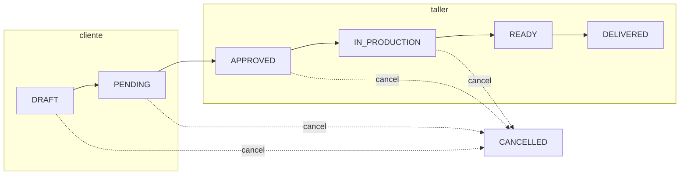

# Flujo de estados del pedido (v1)

Tarjeta **1.3**: máquina de estados, roles y validadores. Implementación en código:

| Pieza | Archivo |
|-------|---------|
| Enum Prisma | `prisma/schema.prisma` → `OrderStatus` |
| Tipos app | `src/types/order-status.ts` |
| Etiquetas UI | `src/lib/order-status.ts` |
| Transiciones + roles | `src/lib/order-transitions.ts` |
| Validadores Zod | `src/lib/validators/order.ts` |
| Permiso en UI/API | `src/lib/permissions.ts` → `canChangeOrderStatus` |
| Aprobar / cancelar | `src/lib/order-workflow.ts` |
| Reservas de pedido | `src/lib/order-reservations.ts` |
| API estado pedido | `src/app/api/orders/[id]/status/route.ts` |

Ver también: [Matriz de permisos](../seguridad/roles-permisos.md).

---

## Estados

```
DRAFT → PENDING → APPROVED → IN_PRODUCTION → READY → DELIVERED
                                                          |
                    CANCELLED ← (desde varios estados) ───┘
```

| Estado | Significado |
|--------|-------------|
| `DRAFT` | Borrador (cliente o taller) |
| `PENDING` | Enviado a revisión |
| `APPROVED` | Aprobado (día 2: reservar materiales) |
| `IN_PRODUCTION` | En taller |
| `READY` | Terminado, pendiente de entrega |
| `DELIVERED` | Entregado (final) |
| `CANCELLED` | Cancelado (final) |

---

## Diagrama



---

## Transiciones y roles

| De → A | CLIENT | WORKER | ADMIN | Notas |
|--------|:------:|:------:|:-----:|-------|
| DRAFT → PENDING | ✓* | ✓ | ✓ | Enviar presupuesto |
| PENDING → APPROVED | — | ✓ | ✓ | Reserva por `plannedQty`; no bloquea por faltantes |
| APPROVED → IN_PRODUCTION | — | ✓ | ✓ | |
| IN_PRODUCTION → READY | — | ✓ | ✓ | |
| READY → DELIVERED | — | ✓ | ✓ | |
| DRAFT → CANCELLED | ✓* | ✓ | ✓ | |
| PENDING → CANCELLED | ✓* | ✓ | ✓ | |
| APPROVED → CANCELLED | — | ✓ | ✓ | Crea `RELEASE` y desactiva reservas activas |
| IN_PRODUCTION → CANCELLED | — | ✓ | ✓ | Crea `RELEASE` y desactiva reservas activas |

\* **CLIENT** solo en pedidos propios (`clientId === session.user.id`); si no, la API responde **403** (`src/lib/order-access.ts`).

No hay transiciones desde `READY`, `DELIVERED` ni `CANCELLED`.

**Flujo feliz de punta a punta (tarjeta 4.4):** [CHECKLIST-ORDERS-QA-4.4.md](../../tools/postman/CHECKLIST-ORDERS-QA-4.4.md) — sección 3 (`DRAFT` → `DELIVERED`, incluye consumo real en `IN_PRODUCTION`).

---

## Aprobación: reservas y faltantes

Al pasar a **`APPROVED`**:

1. Se leen líneas `OrderMaterialLine.plannedQty`.
2. Por cada línea se crea:
   - `OrderReservation` activa (`active = true`),
   - `StockMovement` tipo `RESERVE`.
3. Si `available < plannedQty`, el pedido se marca con:
   - `hasShortages = true`
   - `shortages` con detalle por material.

**Política aplicada:** aprobación con aviso (no bloquea por faltantes).

---

## Cancelación y reservas

Al pasar a **`CANCELLED`** (vía `PATCH /api/orders/:id/status` → `cancelOrder`):

1. Se crean movimientos `StockMovement` tipo `RELEASE` para cada reserva activa del pedido.
2. Se desactivan reservas (`OrderReservation.active = false`).
3. `markReservationsForRelease(orderId)` se mantiene por compatibilidad y delega en `releaseReservationsOnCancel`.

**Verificación manual (tarjeta 4.4):** [CHECKLIST-ORDERS-QA-4.4.md](../../tools/postman/CHECKLIST-ORDERS-QA-4.4.md) — sección 2.

---

## IN_PRODUCTION: consumo real (tarjeta 4.1)

En estado **`IN_PRODUCTION`** se registra consumo real por línea (`actualQty`) desde
`/api/orders/[id]/consume`.

Al confirmar consumo real:

1. Se actualiza `OrderMaterialLine.actualQty` por cada material planificado.
2. Se crea movimiento `StockMovement` tipo `OUT` por la cantidad real consumida.
3. Se crea movimiento `StockMovement` tipo `RELEASE` para liberar la reserva activa asociada.
4. Se cierran reservas (`OrderReservation.active = false`).
5. Se recalcula stock físico (`materials.stock`) y, por definición, el disponible (`physical - reserved`).

Si `actualQty > plannedQty`, la operación se **permite** y se registra:

- aviso funcional en respuesta (`warnings`),
- log operacional explícito (`orders.consume-real.overrun`),
- motivo en movimiento OUT (`Consumo real en producción (exceso sobre plan)`).

---

## Campos editables por estado

Referencia en `ORDER_EDITABLE_FIELDS_BY_STATUS` (`src/lib/validators/order.ts`):

| Estado | Campos |
|--------|--------|
| DRAFT | mueble, params, notas, líneas |
| PENDING | notas, líneas |
| APPROVED | líneas |
| IN_PRODUCTION | líneas (`actualQty` en tarjeta 4.1) |
| READY | mano de obra (`laborAmount`) |
| DELIVERED / CANCELLED | ninguno |

---

## Uso en API

```ts
import { approveOrder, cancelOrder } from "@/lib/order-workflow";
import { consumeRealMaterialsInProduction } from "@/lib/order-reservations";

if (body.status === "APPROVED") {
  await approveOrder(order.id, session.user.role, session.user.id);
}

if (body.status === "CANCELLED") {
  await cancelOrder(order.id, session.user.role, session.user.id);
}

await consumeRealMaterialsInProduction(order.id, [
  { materialId: "mat-1", actualQty: 2.5 },
]);
```
