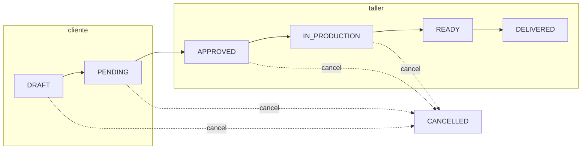

# Flujo de estados del pedido (v1)

Tarjeta **1.3**: máquina de estados, roles y validadores. Implementación en código:

| Pieza | Archivo |
|-------|---------|
| Enum Prisma | `prisma/schema.prisma` → `OrderStatus` |
| Tipos app | `src/types/order-status.ts` |
| Etiquetas UI | `src/lib/order-status.ts` |
| Transiciones + roles | `src/lib/order-transitions.ts` |
| Validadores Zod | `src/lib/validators/order.ts` |
| Permiso en UI/API | `src/lib/permissions.ts` → `canChangeOrderStatus` |
| Cancelar → reservas | `src/lib/order-reservations.ts` → `markReservationsForRelease` |

Ver también: [Matriz de permisos](../seguridad/roles-permisos.md).

---

## Estados

```
DRAFT → PENDING → APPROVED → IN_PRODUCTION → READY → DELIVERED
                                                          |
                    CANCELLED ← (desde varios estados) ───┘
```

| Estado | Significado |
|--------|-------------|
| `DRAFT` | Borrador (cliente o taller) |
| `PENDING` | Enviado a revisión |
| `APPROVED` | Aprobado (día 2: reservar materiales) |
| `IN_PRODUCTION` | En taller |
| `READY` | Terminado, pendiente de entrega |
| `DELIVERED` | Entregado (final) |
| `CANCELLED` | Cancelado (final) |

---

## Diagrama



---

## Transiciones y roles

| De → A | CLIENT | WORKER | ADMIN | Notas |
|--------|:------:|:------:|:-----:|-------|
| DRAFT → PENDING | ✓* | ✓ | ✓ | Enviar presupuesto |
| PENDING → APPROVED | — | ✓ | ✓ | Reservas: tarjeta 2.2 |
| APPROVED → IN_PRODUCTION | — | ✓ | ✓ | |
| IN_PRODUCTION → READY | — | ✓ | ✓ | |
| READY → DELIVERED | — | ✓ | ✓ | |
| DRAFT → CANCELLED | ✓* | ✓ | ✓ | |
| PENDING → CANCELLED | ✓* | ✓ | ✓ | |
| APPROVED → CANCELLED | — | ✓ | ✓ | Marcar reservas |
| IN_PRODUCTION → CANCELLED | — | ✓ | ✓ | Marcar reservas |

\* **CLIENT** solo en pedidos propios (`clientId === session.user.id`); se validará en la API (tarjeta 3.1).

No hay transiciones desde `READY`, `DELIVERED` ni `CANCELLED`.

---

## Cancelación y reservas

Al pasar a **`CANCELLED`**:

1. **Tarjeta 1.3 (ahora):** `markReservationsForRelease(orderId)` pone `active = false` en `OrderReservation`.
2. **Tarjeta 2.2 (día 2):** movimientos `StockMovement` tipo `RELEASE` y recálculo de stock disponible.

---

## Campos editables por estado

Referencia en `ORDER_EDITABLE_FIELDS_BY_STATUS` (`src/lib/validators/order.ts`):

| Estado | Campos |
|--------|--------|
| DRAFT | mueble, params, notas, líneas |
| PENDING | notas, líneas |
| APPROVED | líneas |
| IN_PRODUCTION | líneas (`actualQty` en tarjeta 4.1) |
| READY | mano de obra (`laborAmount`) |
| DELIVERED / CANCELLED | ninguno |

---

## Uso en API (futuro)

```ts
import { parseOrderTransition } from "@/lib/validators/order";
import { markReservationsForRelease } from "@/lib/order-reservations";

const transition = parseOrderTransition(order.status, body, session.user.role);
if (!transition.success) return 400;

if (transition.data.to === "CANCELLED") {
  await markReservationsForRelease(order.id);
}

await db.order.update({
  where: { id: order.id },
  data: { status: transition.data.to },
});
```
