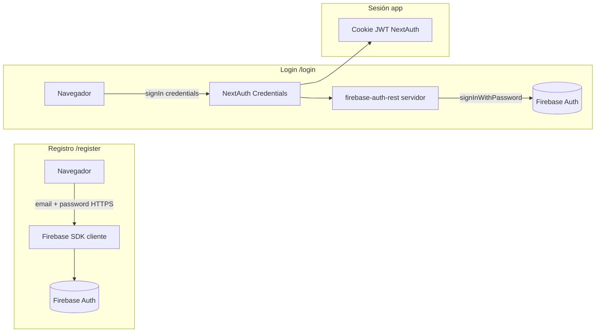

# Credenciales y almacenamiento seguro de contraseñas

Este documento cubre buenas prácticas de **contraseñas** y cómo se aplican en TaskFlow Carpintería con **Firebase Authentication** y **Auth.js (NextAuth)**.

---

## Por qué nunca guardar contraseñas en texto plano

Una contraseña en claro en base de datos implica que:

- Cualquier fuga (backup, SQL injection, empleado con acceso) expone **todas** las cuentas de golpe.
- Muchos usuarios reutilizan la misma contraseña en otros servicios; la filtración se convierte en incidente en cadena.
- Cumplimiento legal y reputación: almacenar contraseñas sin hash es considerado negligencia en la práctica habitual de la industria.

**Regla:** la aplicación solo debe manejar la contraseña **en tránsito** (HTTPS) durante login/registro y delegar el almacenamiento a un sistema que aplique hashing fuerte.

En este proyecto **no hay tabla de usuarios ni campo `password` en el código de la app**. Las contraseñas las gestiona Firebase.

---

## bcrypt y argon2 (resumen práctico)

Son **funciones de hash adaptativas** diseñadas para contraseñas:

| Algoritmo | Idea clave | Uso típico |
| --------- | ---------- | ---------- |
| **bcrypt** | Coste configurable (rounds); lento a propósito | Muy extendido; Firebase y muchos backends lo usan o equivalentes |
| **argon2** | Ganador de Password Hashing Competition; resistencia a GPU/ASIC | Recomendado en guías modernas (OWASP); opción en muchos stacks nuevos |

Propiedades comunes que importan:

- **Unidireccional:** no se «descifra»; solo se verifica comparando hash de la entrada con el almacenado.
- **Lento:** aumenta el coste de fuerza bruta offline.
- **Con salt:** ver siguiente sección.

No necesitas implementar bcrypt/argon2 en TaskFlow: **Firebase Auth** aplica el esquema de hashing en sus servidores al registrar o actualizar contraseñas.

---

## Qué es un salt y por qué evita tablas rainbow

- **Salt:** bytes aleatorios únicos por usuario, mezclados con la contraseña **antes** de hashear.
- Sin salt, dos usuarios con contraseña `123456` tendrían el **mismo** hash → un atacante precalcula una **tabla rainbow** (millones de contraseñas ya hasheadas) y la aplica a toda la base.
- Con salt distinto por usuario, el mismo `123456` produce hashes distintos → hay que atacar **cuenta por cuenta**; las tablas rainbow genéricas pierden utilidad.

El hash almacenado suele incluir algoritmo, coste y salt (p. ej. formato modular de bcrypt), de modo que la verificación en login repite el mismo proceso con la contraseña introducida.

---

## Cómo encaja en TaskFlow: Firebase + Auth Providers

### Registro (`/register`)

- `createUserWithEmailAndPassword` en el cliente (`auth-register-form.tsx`).
- Firebase crea el usuario y almacena el hash de la contraseña; la app **no** persiste la contraseña.
- Variables públicas: `NEXT_PUBLIC_FIREBASE_*` (restringir la API key en Google Cloud Console).

### Login email/contraseña (`/login`)

- El formulario envía email/password a NextAuth (`signIn("credentials", { redirect: false })`).
- En servidor, `CredentialsProvider.authorize` en `src/lib/auth.ts` llama a `signInWithPassword()` (`src/lib/firebase-auth-rest.ts`).
- Petición HTTPS a Identity Toolkit: `accounts:signInWithPassword` con `FIREBASE_API_KEY` (**solo servidor**, sin prefijo `NEXT_PUBLIC_`).
- Si Firebase valida credenciales, NextAuth crea sesión JWT; la contraseña **no** se guarda en la cookie ni en el token de sesión de la app.

### OAuth (GitHub)

- No hay contraseña de la app: la identidad viene del proveedor OAuth. Ver [oauth.md](./oauth.md).

### Errores y UX

- Códigos internos en `src/lib/credentials-sign-in-errors.ts`; mensajes genéricos al usuario (p. ej. «Credenciales inválidas») para no filtrar si el email existe.
- Detalles de Firebase solo en logs de servidor (`firebase-auth-rest.ts`).

---

## Qué guarda la sesión de NextAuth (y qué no)

Tras login correcto, el JWT de sesión incluye aproximadamente:

- `sub` (id de usuario Firebase o id de proveedor OAuth)
- `email`, `name`

**No incluye:** contraseña, `idToken` de Firebase ni refresh tokens de Firebase en el flujo credentials actual (solo se usan para validar y construir el usuario de sesión).

---

## Checklist de seguridad para credenciales en este repo

- [ ] `FIREBASE_API_KEY` solo en servidor; misma clave web restringida por dominio en Google Cloud.
- [ ] `NEXTAUTH_SECRET` fuerte en producción (`openssl rand -base64 32`).
- [ ] HTTPS en producción (Vercel por defecto).
- [ ] No loguear contraseñas ni cuerpos de login en producción.
- [ ] No añadir campos `password` a stores locales, cookies de tareas ni logs.
- [ ] Habilitar solo proveedores necesarios en Firebase Console (Email/Password).

---

## Referencias

- `src/lib/auth.ts` — `CredentialsProvider`
- `src/lib/firebase-auth-rest.ts` — REST `signInWithPassword`
- `src/components/auth-register-form.tsx` — registro Firebase
- `src/components/auth-login-form.tsx` — login credentials y GitHub
- [Firebase Auth — Password accounts](https://firebase.google.com/docs/auth/web/password-auth)
- [OWASP — Password Storage Cheat Sheet](https://cheatsheetseries.owasp.org/cheatsheets/Password_Storage_Cheat_Sheet.html)
