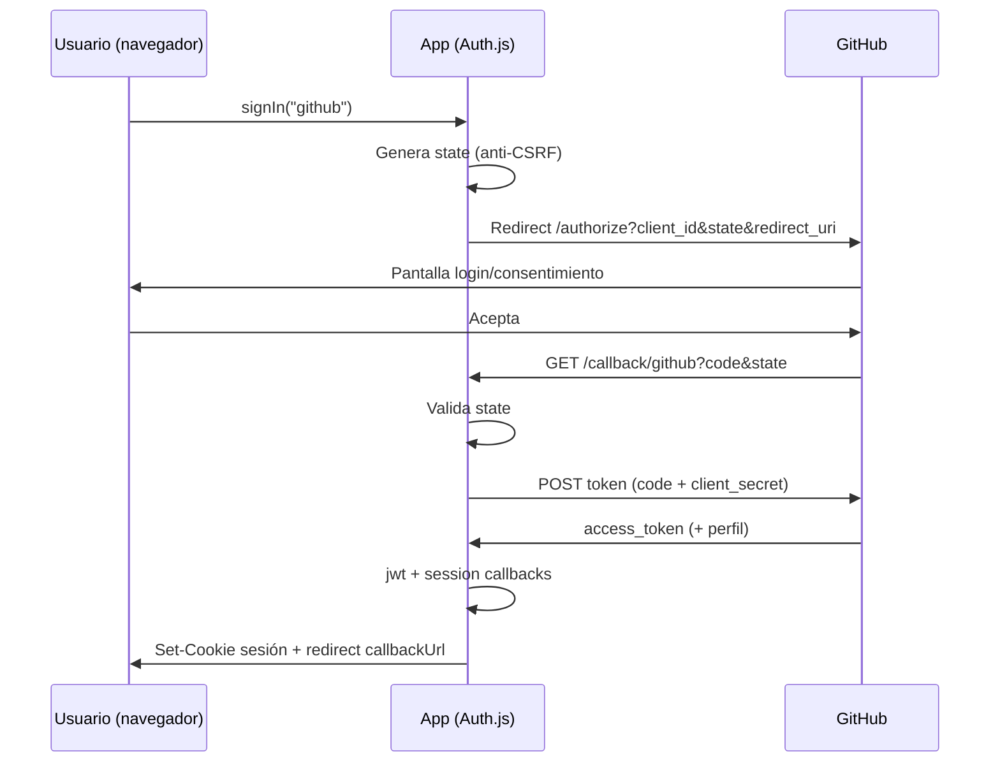

# OAuth 2.0 en TaskFlow Carpintería

Este documento describe el flujo de **login social con GitHub** tal como está implementado con **Auth.js (NextAuth)** en este proyecto. El login con email/contraseña usa Firebase y no pasa por OAuth; ver [credenciales.md](./credenciales.md).

---

## Actores del flujo OAuth 2.0

| Actor | En este proyecto | Responsabilidad |
| ----- | ---------------- | --------------- |
| **Cliente (Resource Owner / usuario)** | Persona que usa el navegador en `/login` | Autoriza el acceso a su identidad en GitHub. |
| **Cliente OAuth (aplicación)** | Next.js + Auth.js (`GITHUB_ID`, `GITHUB_SECRET`) | Inicia la petición de autorización, recibe el `code` en el callback e intercambia tokens en el servidor. |
| **Proveedor de autorización** | GitHub OAuth | Muestra la pantalla de consentimiento y emite el `code` de autorización. |
| **Callback (redirect URI)** | `GET /api/auth/callback/github` | Endpoint registrado en la app OAuth de GitHub; GitHub redirige aquí tras el consentimiento. |

La **sesión de la aplicación** no es el token de GitHub: Auth.js crea su propia sesión (JWT firmado con `NEXTAUTH_SECRET`) tras validar la identidad con GitHub.

---

## Flujo paso a paso: clic en login social → retorno autenticado

### 1. Usuario en `/login`

- Si `GITHUB_ID` y `GITHUB_SECRET` están definidos, la página muestra **«Continuar con GitHub»** (`AuthLoginForm`, prop `githubOAuthEnabled`).
- El destino post-login se calcula con `getPostLoginDestination()` a partir de `callbackUrl` o `next` en la query (rutas internas seguras).

### 2. Clic en «Continuar con GitHub»

```ts
await signIn("github", { callbackUrl: postLoginDestination });
```

- El cliente llama a Auth.js (`/api/auth/signin/github`).
- Auth.js genera la URL de autorización de GitHub e incluye parámetros estándar OAuth 2.0.

### 3. Redirección al proveedor (GitHub)

El navegador sale de la app y el usuario ve la pantalla de GitHub:

- Inicio de sesión en GitHub (si hace falta).
- Consentimiento para que la app OAuth acceda a datos básicos del perfil.

### 4. GitHub redirige al callback

GitHub envía al navegador una petición a:

```text
https://<tu-dominio>/api/auth/callback/github?code=<authorization_code>&state=<state>
```

- **`code`**: código de autorización de un solo uso y corta vida.
- **`state`**: valor que Auth.js generó al iniciar el flujo; se valida en el callback para mitigar **CSRF** (un atacante no puede forzar un callback válido sin conocer el `state` de la sesión iniciada).

### 5. Intercambio de token (solo servidor)

En el Route Handler `src/app/api/auth/[...nextauth]/route.ts`, Auth.js (servidor):

1. Comprueba que `state` coincide con el valor guardado al iniciar el flujo.
2. Intercambia el `code` por tokens en GitHub usando `GITHUB_SECRET` (nunca expuesto al navegador).
3. Obtiene el perfil del usuario (id, email, nombre según scopes).
4. Ejecuta callbacks `jwt` y `session` definidos en `src/lib/auth.ts`.

### 6. Creación de sesión en la aplicación

- Estrategia de sesión: **JWT** (`session.strategy: "jwt"`, `maxAge` 8 horas).
- Auth.js establece la **cookie de sesión** firmada con `NEXTAUTH_SECRET`.
- El navegador es redirigido a `callbackUrl` (por defecto `/dashboard` si no hay query válida).

### 7. Rutas protegidas

- El **middleware** (`middleware.ts`) lee el JWT en peticiones siguientes y permite o deniega acceso a `/dashboard`, `/tasks/*`, `/stats` y `/api/tasks/*`.
- Si el usuario autenticado visita `/login` o `/register`, se redirige al destino post-login.

---

## Rol de `state`, `code`, token y sesión



| Elemento | Dónde vive | Para qué sirve |
| -------- | ---------- | -------------- |
| **`state`** | Generado por Auth.js; validado en callback | Evitar que un tercero enganche al usuario en un callback OAuth ajeno (CSRF). |
| **`code`** | Query del callback; consumido en servidor | Prueba de que el usuario autorizó en GitHub; se canjea una vez por tokens. |
| **Token de acceso GitHub** | Solo en servidor durante el intercambio | Consultar API de GitHub si hiciera falta; no se guarda en la cookie de sesión de la app. |
| **Sesión Auth.js (JWT en cookie)** | Navegador (httpOnly según configuración de Auth.js) | Identidad dentro de TaskFlow; firma con `NEXTAUTH_SECRET`. |

---

## Configuración en el proyecto

| Variable | Uso |
| -------- | --- |
| `GITHUB_ID` | Client ID de la OAuth App en GitHub. |
| `GITHUB_SECRET` | Client secret; solo servidor. |
| `NEXTAUTH_URL` | URL pública de la app (local: `http://localhost:3000`). |
| `NEXTAUTH_SECRET` | Firma del JWT de sesión. |

**Callback URLs** en GitHub Developer Settings → OAuth Apps:

- Desarrollo: `http://localhost:3000/api/auth/callback/github`
- Producción: `https://<tu-dominio>/api/auth/callback/github`

`src/lib/server-env.ts` exige que `GITHUB_ID` y `GITHUB_SECRET` estén **ambos definidos o ambos vacíos**; si faltan, el botón de GitHub no se muestra.

---

## Riesgos comunes y mitigaciones básicas

| Riesgo | Descripción | Mitigación en este proyecto |
| ------ | ----------- | ---------------------------- |
| **CSRF en OAuth** | Atacante inyecta su `code` en el callback de la víctima. | Parámetro `state` validado por Auth.js. |
| **Secreto en el cliente** | Exponer `GITHUB_SECRET` en JS del navegador. | Intercambio `code` → token solo en Route Handler servidor. |
| **Open redirect** | `callbackUrl` apunta a sitio externo. | `getPostLoginDestination()` / `isSafeInternalPath()` rechazan URLs que no empiezan por `/` interno. |
| **Callback URL incorrecta** | GitHub rechaza el flujo o redirige a otro host. | Registrar exactamente `/api/auth/callback/github` en la OAuth App y alinear `NEXTAUTH_URL`. |
| **Session fixation** | Forzar sesión ajena tras login. | Nueva sesión JWT emitida por Auth.js tras OAuth exitoso. |
| **Token en logs o URL** | Filtrar `code` o tokens en historial. | Auth.js consume el `code` en servidor; no persistir tokens de GitHub en la app. |
| **OAuth opcional mal configurado** | Solo una de las variables GitHub definida. | Validación en build (`assertGithubPair`). |

---

## Referencias en el código

- Proveedor: `GitHubProvider` en `src/lib/auth.ts`
- UI: `onGitHubSignIn` en `src/components/auth-login-form.tsx`
- Handler: `src/app/api/auth/[...nextauth]/route.ts`
- Redirecciones seguras: `src/lib/safe-redirect.ts`
