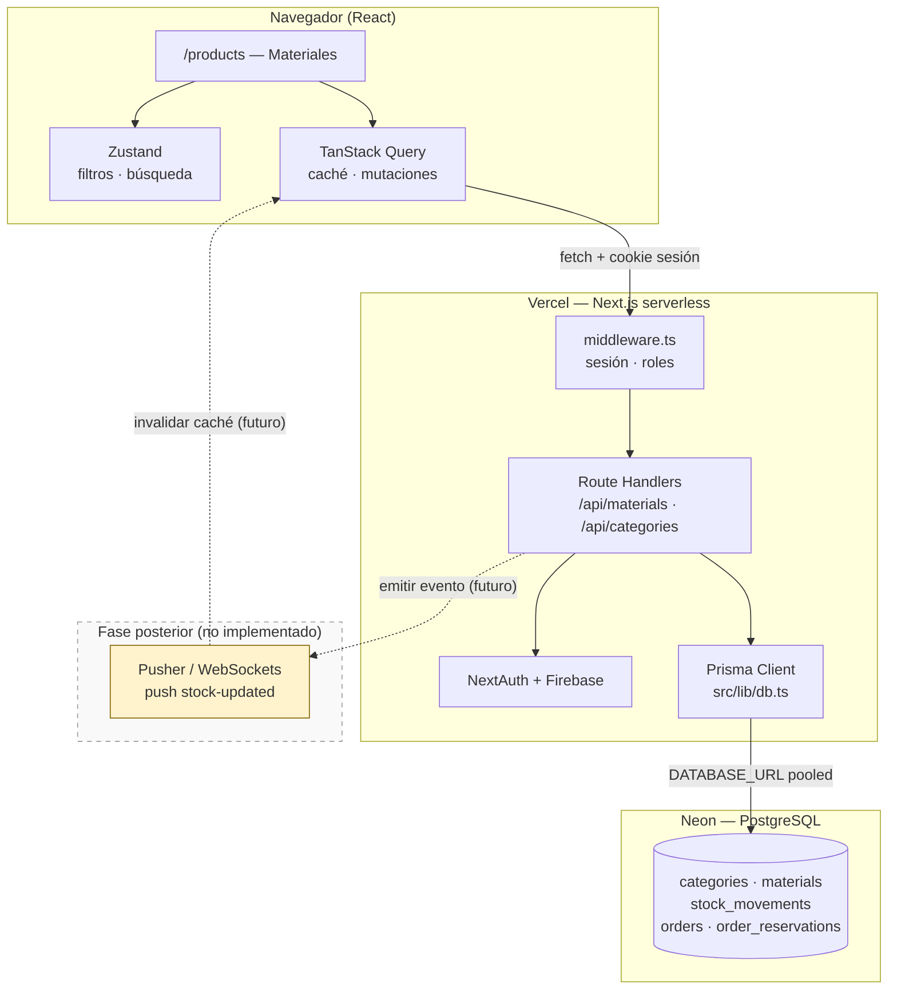
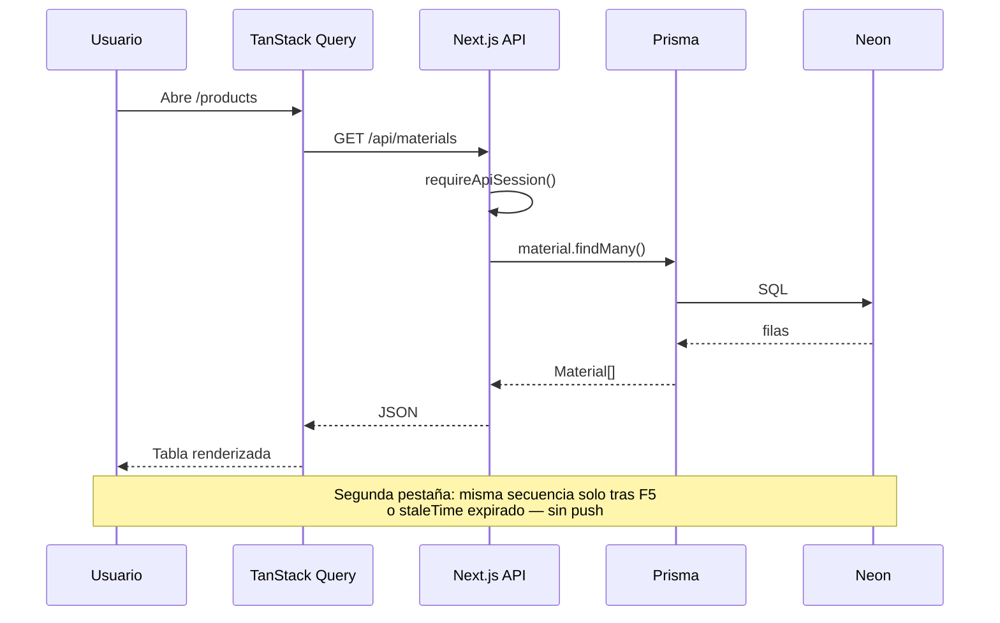
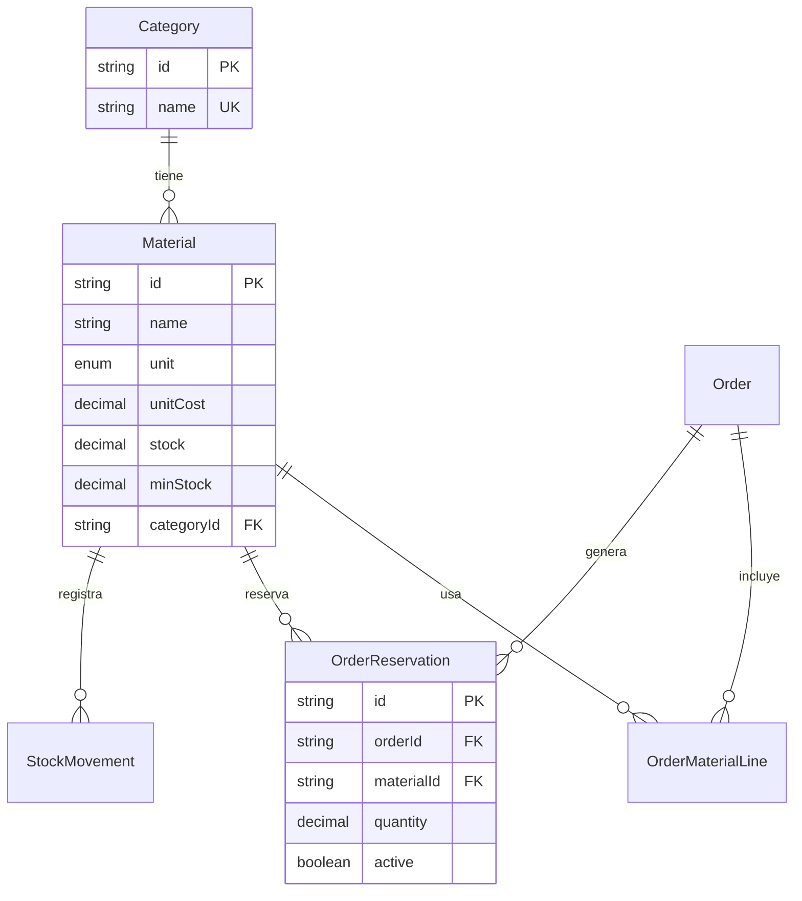

# Diagrama de arquitectura — demo vídeo 3.2

> **Uso:** compartir pantalla en el bloque 1:45–2:45 del guión.  
> Puedes exportar este Mermaid a PNG desde [mermaid.live](https://mermaid.live) o redibujarlo en Excalidraw.

---

## Vista para el vídeo (Mermaid)



---

## Flujo de lectura de materiales (secuencia)



---

## Modelo datos (inventario + reservas)



**Fórmula en voz alta:** disponible = físico − reservado activo.

---

## ASCII rápido (si no cargas Mermaid)

```
┌──────────────┐     HTTPS      ┌─────────────────────────┐
│  Navegador   │ ─────────────► │  Vercel / Next.js       │
│  Query+Zustand│ ◄──────────── │  /api/materials + Auth  │
└──────────────┘                └───────────┬─────────────┘
                                            │ Prisma (pool)
                                            ▼
                                ┌─────────────────────────┐
                                │  Neon PostgreSQL        │
                                │  materials, movements,  │
                                │  order_reservations     │
                                └─────────────────────────┘

        - - - - Pusher (futuro) - - - -► invalidar Query
```

---

## Exportar PNG borrador

1. Copia el primer bloque Mermaid a https://mermaid.live
2. **Actions → PNG** → guardar como `docs/video/diagrama-arquitectura.png`
3. En el ensayo, alterna entre PNG y demo en Vercel
